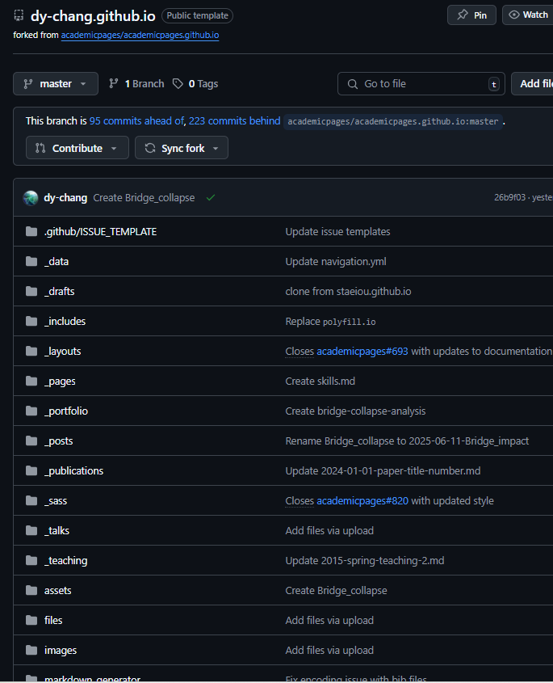

You can write a more detailed description of the project here. Explain the purpose of the visualization, the challenges you faced, or what the data reveals.

## Preview

## Live Demo

Click the link below to explore the interactive map yourself.

[**>> Click here for the Live Demo**](https://dy-chang.github.io/winnipeg-transit-accessibility-map/)
