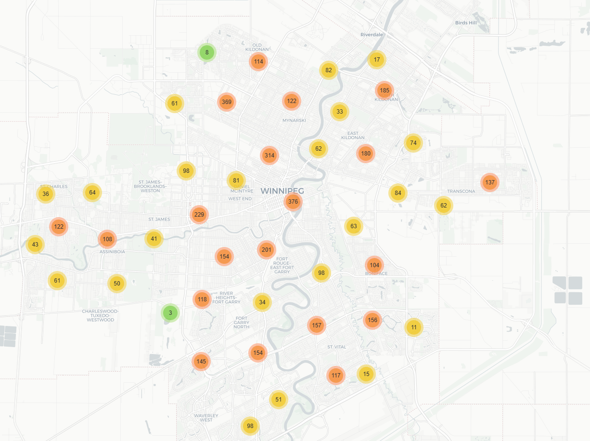

This interactive map visualizes public transport accessibility in Winnipeg, showcasing service frequency across 2-hour time periods (e.g., 8 AM - 10 AM). Built with Folium using GTFS data, it features color-coded circle markers sized by frequency, toggleable layers for each time period (viridis palette: purple for early morning, yellow for late evening), clustered markers for dense areas, and an optional heatmap for service density. Click markers to view stop names and frequencies, and explore route lines for network context. Ideal for understanding daily transit patterns.

## Preview

## Live Demo

Click the link below to explore the interactive map yourself.

[**>> Click here for the Live Demo**](https://dy-chang.github.io/winnipeg-transit-accessibility-map/)
